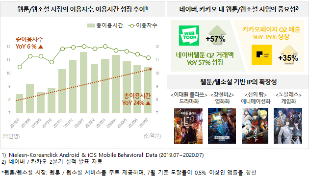
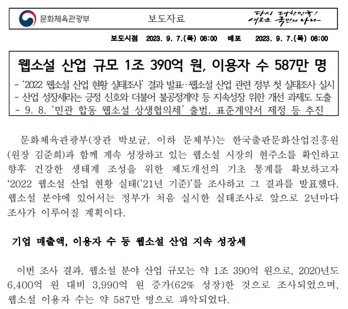
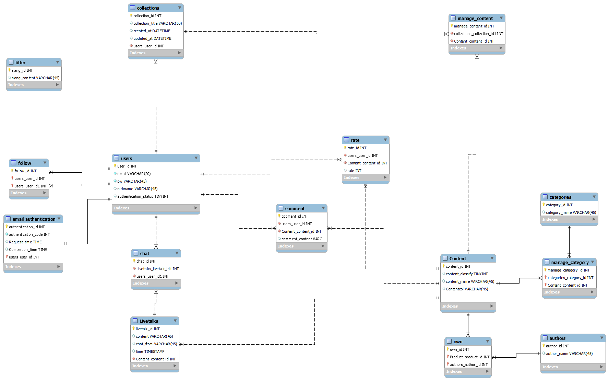
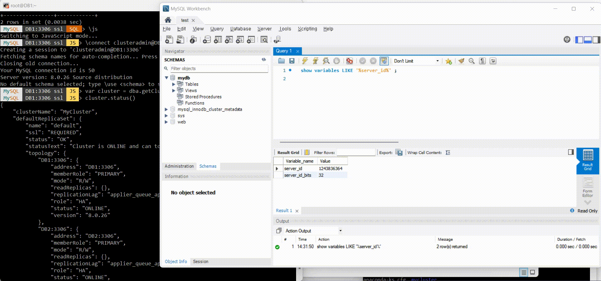

<h1 align=center> BOOKSPEDIA👍</h1>

     

> [플레이 데이터] 한화시스템 BEYOND SW캠프 / 팀명 : hjhg..

 

## ✨ 프로젝트 설명

저희 서비스는 사용자가 본 웹툰/웹소설에 대해 별점 및 리뷰를 남기고 컬렉션을 만들어 공유할 수 있습니다.
또한 매주 새롭게 올라오는 회차에 대한 라이브톡을 진행하여 독자 모두가 모여 이야기하며 작품에 대한 감상을 나눌 수 있습니다.  

## ✨ 프로젝트 배경

      
    

출처 : [닐슨코리아클릭](https://www.koreanclick.com/insights/newsletter_view.html?code=topic&id=586&page=1&utm_source=board&utm_medium=board&utm_campaign=topic&utm_content=20200826) |
[문화체육관광부 보도자료](https://www.mcst.go.kr/kor/s_notice/press/pressView.jsp?pSeq=20472)

현재 웹툰 및 웹소설을 드라마로 제작한 작품들이 성공을 거두며,
이로 인해 원작에 대한 관심도가 상승하고 있습니다. 
닐슨코리아클릭의 통계에 따르면, 2020년 7월에 웹툰과 웹소설의
총 이용시간은 전년 동월 대비 24% 증가했습니다. 
또한 문체부의 보고에 따르면, 웹소설 산업의 규모는 1조 390억 원으로 나타났습니다.
하지만 규모에 비해 작품 정보를 얻을 수 있는 충분한 곳이 부족한 상황입니다.

우리는 동일한 작품을 공유하는 사용자 간에는 서로 다른 시각과 해석을 나누며
다양한 관점을 탐험하여 더욱 만족스러운 작품 감상을 즐길 수 있습니다. 

## 📌 프로젝트 구현

### ERD

    

### Cluster 서버 구성

- 연결된 서버 다운시 router가 다른 서버에  연결시켜줌

    

## 🤼‍♂️팀원

Team : 🐯 **김현균**

Team : 🐶 **이석하**

Team : 🐺 **이주현**

Team : 🐱 **전민재**

Team : 🦁 **홍현주**
